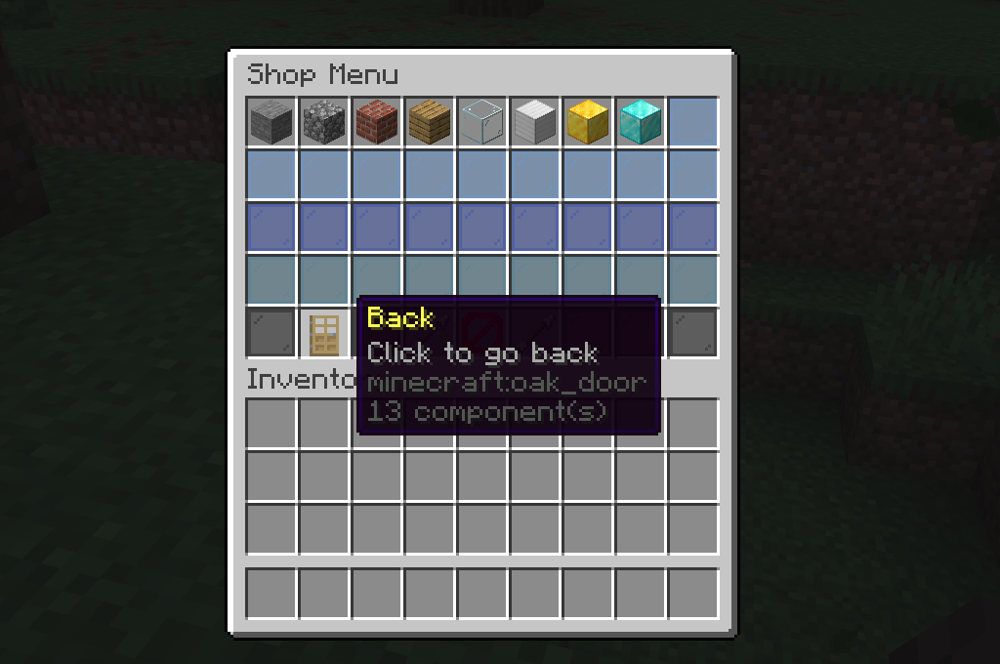
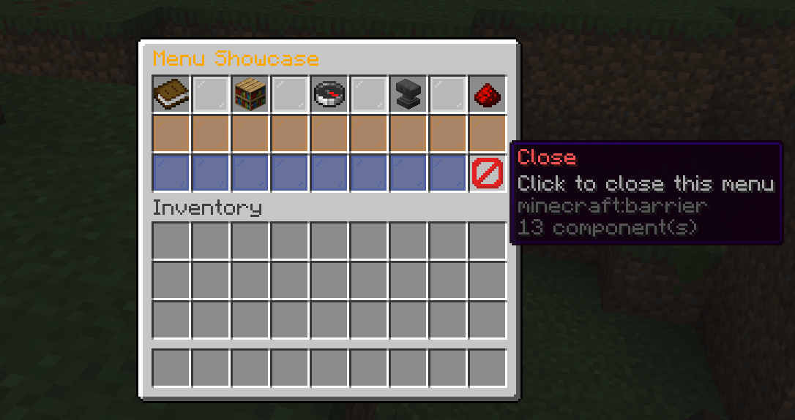
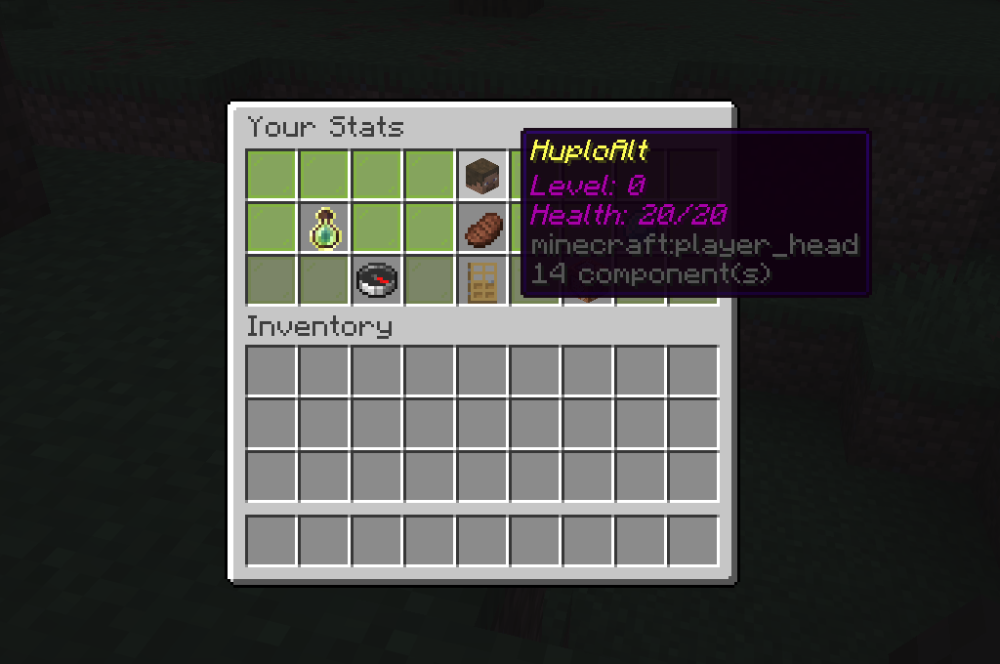
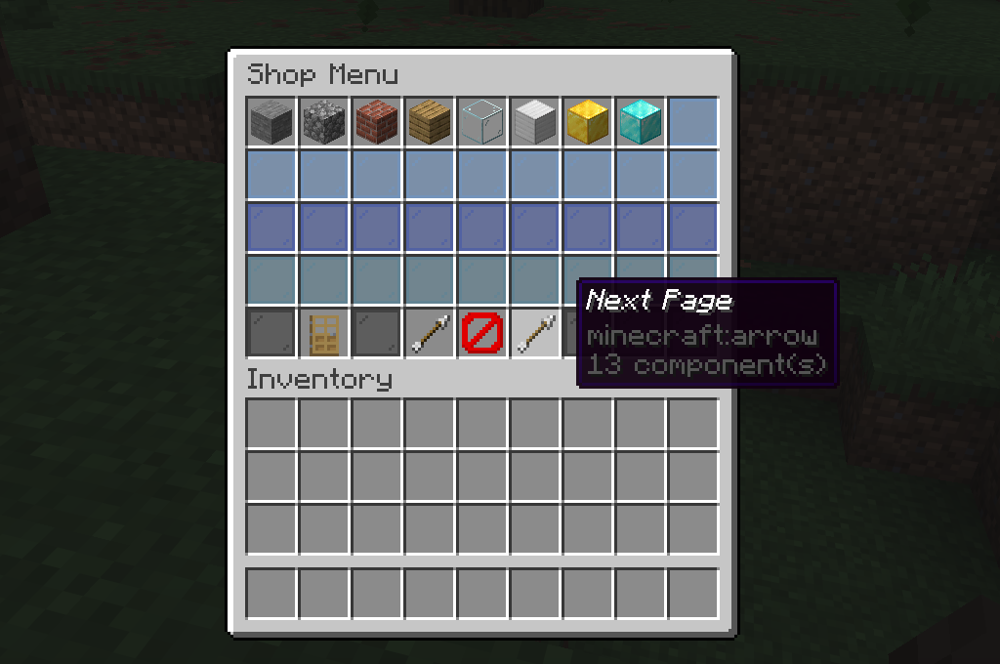
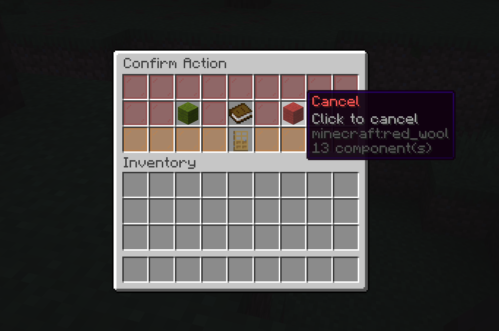

# BetterInterfaces - Developer Documentation

A powerful and flexible menu system for Minecraft plugins built on the Bukkit/Spigot API. BetterInterfaces provides an easy-to-use, event-driven API for creating dynamic GUIs with features like menu navigation, pageable menus, event handling, and more.


## Table of Contents

1. [Getting Started](#getting-started)
2. [Core Concepts](#core-concepts)
3. [Creating Your First Menu](#creating-your-first-menu)
4. [Menu Definitions](#menu-definitions)
5. [Menu Items](#menu-items)
6. [Event Handling](#event-handling)
7. [Menu Sessions and Navigation](#menu-sessions-and-navigation)
8. [Menu Context](#menu-context)
9. [Pageable Menus](#pageable-menus)
10. [Custom Menus and Items](#custom-menus-and-items)
11. [Utility Methods](#utility-methods)
12. [Advanced Features](#advanced-features)
13. [API Reference](#api-reference)
14. [Examples](#examples)

## Getting Started

### Dependencies

Add BetterInterfaces as a dependency in your `build.gradle`:

```gradle
dependencies {
    implementation 'be.mathijsfollon:BetterInterfaces:1.0.0'
}
```

Or if using Maven, add to your `pom.xml`:

```xml
<dependency>
    <groupId>be.mathijsfollon</groupId>
    <artifactId>BetterInterfaces</artifactId>
    <version>1.0.1</version>
</dependency>
```

### Basic Setup

1. **Get the MenuService**: BetterInterfaces provides a `MenuService` that manages all menus. Load it using the Bukkit Services API:

```java
import be.mathijsfollon.betterInterfaces.api.MenuService;
import org.bukkit.Bukkit;

public class YourPlugin extends JavaPlugin {
    private MenuService menuService;
    
    @Override
    public void onEnable() {
        // Load the MenuService from Bukkit Services API
        menuService = Bukkit.getServicesManager().load(MenuService.class);
        
        if (menuService == null) {
            getLogger().warning("MenuService not found! Make sure BetterInterfaces is installed and enabled.");
            return;
        }
        
        // Now you can use menuService
    }
}
```

2. **Register Your Menus**: Create menu definitions and register them with the service:

```java
menuService.registerMenu(new MyMenuDefinition());
```

## Core Concepts

### MenuDefinition

A `MenuDefinition` is a factory that creates menu instances. It defines:
- The menu's unique ID
- Size (number of rows, 1-6)
- Title
- How to create and configure the menu

### Menu

A `Menu` represents an actual opened inventory. It manages the items displayed and handles player interactions.

### MenuSession

A `MenuSession` represents an active menu session for a player. It provides:
- Access to the menu instance
- Navigation stack (for back buttons)
- Event manager for custom events
- Methods to open/close the menu

### MenuItem

A `MenuItem` represents an item in a menu slot. It has:
- Slot position
- ItemStack to display
- Whether it can be moved/taken by the player

### MenuOpenContextStore

A context object that passes data when opening menus. It's a thread-safe key-value store for:
- Player information
- Custom data (plugin, services, etc.)
- Navigation context

## Creating Your First Menu

### Using AbstractMenuDefinition (Recommended)

The easiest way to create a menu is by extending `AbstractMenuDefinition`:

```java
import be.mathijsfollon.betterInterfaces.api.Menu;
import be.mathijsfollon.betterInterfaces.api.MenuOpenContextStore;
import be.mathijsfollon.betterInterfaces.api.events.MenuEventHandler;
import be.mathijsfollon.betterInterfaces.events.MenuClickEvent;
import be.mathijsfollon.betterInterfaces.menu.AbstractMenuDefinition;
import be.mathijsfollon.betterInterfaces.menu.SimpleMenu;
import be.mathijsfollon.betterInterfaces.menu.SimpleMenuItem;
import net.kyori.adventure.text.Component;
import org.bukkit.Material;
import org.bukkit.entity.Player;
import org.bukkit.inventory.ItemStack;

public class MyMenu extends AbstractMenuDefinition {
    
    public MyMenu() {
        super("my-menu", "My Menu", 3); // ID, title, rows (3 rows = 27 slots)
    }
    
    @Override
    public Menu onCreate(Menu menu, MenuOpenContextStore ctx) {
        if (!(menu instanceof SimpleMenu simpleMenu)) {
            return menu;
        }
        
        // Add items to the menu
        ItemStack item = new ItemStack(Material.DIAMOND);
        item.editMeta(meta -> {
            meta.displayName(Component.text("Click me!"));
        });
        
        simpleMenu.addItem(new SimpleMenuItem(13, item)); // Slot 13 (center of second row)
        
        return menu;
    }
    
    // Handle clicks
    @MenuEventHandler
    public void onMenuClick(MenuClickEvent event) {
        event.setCancelled(true); // Prevent taking items
        
        Player player = event.getPlayer();
        player.sendMessage("You clicked an item!");
    }
}
```

### Opening the Menu

To open a menu for a player:

```java
import be.mathijsfollon.betterInterfaces.menu.MenuOpenContext;

// Create context
MenuOpenContextStore ctx = new MenuOpenContext();
ctx.put("plugin", yourPluginInstance);
ctx.put("player", player);

// Open the menu
try {
    MenuSession session = menuService.openMenu(player, "my-menu", ctx);
} catch (MenuNotRegisteredException e) {
    player.sendMessage("Menu not found!");
}
```

## Menu Definitions

### AbstractMenuDefinition

The base class for most menu definitions. It provides:

- Automatic menu creation (creates a `SimpleMenu`)
- Event listener registration (implement `MenuEventListener`)
- Easy menu configuration in `onCreate()`

**Constructor Parameters:**
- `id`: Unique identifier for the menu (required for registration)
- `title`: Menu title (supports legacy color codes with `&`)
- `rows`: Number of rows (1-6, determines inventory size)

**Key Methods to Override:**

- `onCreate(Menu menu, MenuOpenContextStore ctx)`: Configure the menu after creation
- `getItemStacks()`: Return static items (optional, for static menus)

### Implementing MenuDefinition Directly

For custom menu creation logic, implement `MenuDefinition` directly:

```java
public class CustomMenuDefinition implements MenuDefinition {
    @Override
    public String getId() {
        return "custom-menu";
    }
    
    @Override
    public int getSize() {
        return 27; // 3 rows
    }
    
    @Override
    public Component getTitle() {
        return Component.text("Custom Menu");
    }
    
    @Override
    public List<ItemStack> getItemStacks() {
        return List.of(); // Empty for dynamic menus
    }
    
    @Override
    public Menu create(MenuOpenContextStore ctx, CompletableFuture<MenuOpenEvent> sessionFuture) {
        // Custom menu creation logic
        Plugin plugin = ctx.get("plugin", Plugin.class).orElseThrow();
        Player player = ctx.getPlayer().orElseThrow();
        MenuService service = ctx.get("menu-service", MenuService.class).orElseThrow();
        
        // Create your custom menu implementation
        return new MyCustomMenu(/* ... */);
    }
}
```

## Menu Items

### SimpleMenuItem

The default implementation of `MenuItem`. Create items easily:

```java
// Non-movable item (default)
SimpleMenuItem item = new SimpleMenuItem(slot, itemStack);

// Movable item (can be taken)
SimpleMenuItem movableItem = new SimpleMenuItem(slot, itemStack, true);
```

### Adding Items to Menus

In `AbstractMenu` implementations (like `SimpleMenu`):

```java
simpleMenu.addItem(new SimpleMenuItem(10, itemStack));
```

### Item Properties

- **Slot**: Position in the inventory (0-53 for 6 rows)
- **ItemStack**: The item to display
- **Movable**: Whether players can take/move the item (default: false)

### Custom MenuItem

Extend `AbstractMenuItem` for custom behavior:

```java
public class CustomMenuItem extends AbstractMenuItem {
    private int clickCount;
    
    public CustomMenuItem(int slot, ItemStack itemStack) {
        super(slot, itemStack, false); // Not movable
        this.clickCount = 0;
    }
    
    public void onClick() {
        clickCount++;
        // Custom click logic
    }
}
```

## Event Handling

### MenuEventListener

Menu definitions that extend `AbstractMenuDefinition` automatically implement `MenuEventListener`, allowing them to handle menu events.

### Event Types

#### MenuClickEvent

Fired when a player clicks an item in the menu:

```java
@MenuEventHandler
public void onMenuClick(MenuClickEvent event) {
    event.setCancelled(true); // Prevent item movement
    
    Player player = event.getPlayer();
    MenuItem clickedItem = event.getMenuItem();
    int slot = event.getSlot();
    ItemStack item = event.getItem();
    
    // Handle the click
}
```

**Properties:**
- `getPlayer()`: The player who clicked
- `getMenuItem()`: The MenuItem that was clicked (null if empty slot)
- `getItem()`: The ItemStack in the slot
- `getSlot()`: The slot number clicked
- `getClickType()`: The type of click (LEFT, RIGHT, etc.)
- `getContext()`: The menu context
- `getSession()`: The menu session

#### MenuOpenEvent

Fired when a menu is opened:

```java
@MenuEventHandler
public void onMenuOpen(MenuOpenEvent event) {
    Player player = event.getPlayer();
    Menu menu = event.getMenu();
    
    player.sendMessage("Menu opened!");
}
```

#### MenuCloseEvent

Fired when a menu is closed:

```java
@MenuEventHandler
public void onMenuClose(MenuCloseEvent event) {
    Player player = event.getPlayer();
    boolean silently = event.isSilent(); // true if closed programmatically
    
    if (!silently) {
        player.sendMessage("You closed the menu!");
    }
}
```

### Event Priority

Control handler execution order with priorities:

```java
@MenuEventHandler(priority = -10) // Called first (low priority)
public void onEarlyClick(MenuClickEvent event) {
    System.out.println("Early handler");
}

@MenuEventHandler(priority = 10) // Called last (high priority)
public void onLateClick(MenuClickEvent event) {
    System.out.println("Late handler");
}
```

**Priority Rules:**
- Lower priority = executed first
- Default priority = 0
- Negative priorities run before default
- Positive priorities run after default

### Event Cancellation

Cancel events to prevent default behavior:

```java
@MenuEventHandler
public void onMenuClick(MenuClickEvent event) {
    event.setCancelled(true); // Prevents item movement
}
```

**Note**: Always cancel `MenuClickEvent` if you don't want items to be movable.

### Ignoring Cancelled Events

Skip handling if the event was already cancelled:

```java
@MenuEventHandler(ignoreCancelled = true)
public void onMenuClick(MenuClickEvent event) {
    // Only called if event is not cancelled
}
```

### Event Scoping

Events are automatically scoped to the menu definition class. A `MenuEventListener` only receives events for menus created by that class.

This allows multiple menu definitions to handle events independently:

```java
public class MenuA extends AbstractMenuDefinition {
    @MenuEventHandler
    public void onClick(MenuClickEvent event) {
        // Only receives events for MenuA instances
    }
}

public class MenuB extends AbstractMenuDefinition {
    @MenuEventHandler
    public void onClick(MenuClickEvent event) {
        // Only receives events for MenuB instances
    }
}
```

## Menu Sessions and Navigation

### MenuSession

A session represents an active menu for a player:

```java
MenuSession session = menuService.openMenu(player, "menu-id", context);

// Check if open
if (session.isOpen()) {
    // Menu is currently open
}

// Close the menu
session.close(); // Normal close (fires close event)
session.close(true); // Silent close (no close event)
```

### Navigation Stack

Menus support a navigation stack for "back" functionality:

```java
// Open a menu from another menu
MenuSession newSession = menuService.openMenu(player, "next-menu", context, currentSession);
// currentSession becomes the "previous" session for navigation
```

### Back Button



Add a back button that navigates to the previous menu:

```java
@Override
public Menu onCreate(Menu menu, MenuOpenContextStore ctx) {
    if (!(menu instanceof SimpleMenu simpleMenu)) {
        return menu;
    }
    
    // Add back button (only shown if there's a previous menu)
    simpleMenu.addBackButton(22, ctx); // Slot 22, pass context for checking previous session
    
    return menu;
}
```

**Note**: Always pass the `ctx` parameter from `onCreate()` to `addBackButton()` so it can check for a previous session.

### Navigating Back Programmatically

```java
MenuSession session = /* get current session */;

if (session.getPreviousSession().isPresent()) {
    session.goBack(); // Closes current menu and opens previous
}
```

### Close Button



Add a close button:

```java
simpleMenu.addCloseButton(26); // Slot 26
```

The close button automatically handles closing the menu.

## Menu Context

### MenuOpenContextStore



Context is a thread-safe key-value store for passing data to menus:

```java
MenuOpenContextStore ctx = new MenuOpenContext();

// Store data
ctx.put("plugin", plugin);
ctx.put("player", player);
ctx.put("custom-data", "value");

// Retrieve data
Optional<Player> player = ctx.getPlayer();
Optional<Plugin> plugin = ctx.get("plugin", Plugin.class);
Optional<String> data = ctx.get("custom-data", String.class);
```

### Required Context Keys

When opening a menu, these keys should be set:

- `"plugin"`: Your plugin instance (Plugin)
- `"player"`: The player (automatically set by MenuService)
- `"menu-service"`: MenuService instance (automatically set by MenuService)

### Context in Menu Creation

Access context in `onCreate()`:

```java
@Override
public Menu onCreate(Menu menu, MenuOpenContextStore ctx) {
    // Get player
    Player player = ctx.getPlayer().orElse(null);
    
    // Get custom data
    String message = ctx.get("message", String.class).orElse("Default");
    
    // Use the data to configure the menu
}
```

### Context in Events

Access context in event handlers:

```java
@MenuEventHandler
public void onMenuClick(MenuClickEvent event) {
    MenuOpenContextStore ctx = event.getContext();
    String data = ctx.get("custom-data", String.class).orElse("none");
}
```

## Pageable Menus



### Creating a Pageable Menu

Use `SimplePageableMenu` for multi-page menus:

```java
public class MyPageableMenu extends AbstractMenuDefinition {
    
    public MyPageableMenu() {
        super("pageable-menu", "Shop", 4); // 4 content rows + 1 navigation row
    }
    
    @Override
    public Menu create(MenuOpenContextStore ctx, CompletableFuture<MenuOpenEvent> sessionFuture) {
        Plugin plugin = ctx.get("plugin", Plugin.class).orElseThrow();
        Player player = ctx.getPlayer().orElseThrow();
        MenuService service = ctx.get("menu-service", MenuService.class).orElseThrow();
        
        // Create pageable menu with 4 content rows
        SimplePageableMenu pageableMenu = new SimplePageableMenu(
            Component.text("Shop"),
            4, // 4 content rows (navigation row added automatically)
            player,
            service.getEventManager(),
            plugin
        );
        
        // Create pages (each page is a MenuDefinition)
        List<MenuDefinition> pages = createPages();
        pageableMenu.addPages(pages);
        
        // Set navigation items
        ItemStack prevButton = new ItemStack(Material.ARROW);
        ItemStack nextButton = new ItemStack(Material.ARROW);
        ItemStack closeButton = new ItemStack(Material.BARRIER);
        
        pageableMenu.setNavigationItems(prevButton, nextButton, closeButton);
        
        return pageableMenu;
    }
    
    private List<MenuDefinition> createPages() {
        List<MenuDefinition> pages = new ArrayList<>();
        
        // Create page 1
        pages.add(new AbstractMenuDefinition("page-1", "Page 1", 4) {
            @Override
            public Menu onCreate(Menu menu, MenuOpenContextStore ctx) {
                // Add items for page 1
                return menu;
            }
        });
        
        // Create page 2
        pages.add(new AbstractMenuDefinition("page-2", "Page 2", 4) {
            @Override
            public Menu onCreate(Menu menu, MenuOpenContextStore ctx) {
                // Add items for page 2
                return menu;
            }
        });
        
        return pages;
    }
}
```

### Navigation Row

The navigation row is automatically added at the bottom with:
- Back button (slot 1) - if previous menu exists
- Previous page button (slot 3) - if has previous page
- Close button (slot 4) - if set
- Next page button (slot 5) - if has next page

### PageableMenu Interface

For programmatic control:

```java
if (menu instanceof PageableMenu pageable) {
    pageable.nextPage();
    pageable.previousPage();
    pageable.goToPage(2);
    
    int currentPage = pageable.getCurrentPage();
    int totalPages = pageable.getPageCount();
    boolean hasNext = pageable.hasNextPage();
    boolean hasPrev = pageable.hasPreviousPage();
}
```

## Custom Menus and Items

### Extending AbstractMenu

Create custom menu behavior:

```java
public class MyCustomMenu extends AbstractMenu {
    
    public MyCustomMenu(Component title, int size, Player player, 
                       MenuEventManager eventManager, Plugin plugin) {
        super(title, size, player, eventManager, plugin);
    }
    
    @Override
    public void onInventoryClick(InventoryClickEvent event) {
        // Custom click handling before default
        super.onInventoryClick(event);
        
        // Additional custom logic after default
    }
}
```

### Extending AbstractMenuItem

Create items with custom behavior:

```java
public class ShopItem extends AbstractMenuItem {
    private final int price;
    
    public ShopItem(int slot, ItemStack itemStack, int price) {
        super(slot, itemStack, false); // Not movable
        this.price = price;
    }
    
    public int getPrice() {
        return price;
    }
}
```

## Utility Methods

### Filling Empty Slots

#### Default Fill (Glass Panes)

Fill all empty slots with glass panes:

```java
simpleMenu.fillEmptySlots(); // Uses GRAY_STAINED_GLASS_PANE by default
simpleMenu.fillEmptySlots(Material.BLUE_STAINED_GLASS_PANE); // Custom color
```

#### Gradient Fill

Fill with a gradient from top to bottom:

```java
simpleMenu.fillGradient(
    Material.WHITE_STAINED_GLASS_PANE,  // Start color (top)
    Material.BLACK_STAINED_GLASS_PANE   // End color (bottom)
);
```

The gradient automatically applies colors row by row from top to bottom.

### Adding Navigation Buttons

#### Back Button

```java
// Only shown if there's a previous menu
MenuItem backButton = simpleMenu.addBackButton(22, ctx);
if (backButton == null) {
    // No previous menu, button wasn't added
}
```

**Important**: Always pass the `ctx` parameter from `onCreate()`.

#### Close Button

```java
simpleMenu.addCloseButton(26); // Slot 26
```

### Making Menus Uncloseable



Prevent players from closing the menu (useful for confirmation dialogs):

```java
@MenuEventHandler
public void onMenuOpen(MenuOpenEvent event) {
    if (event.getMenu() instanceof SimpleMenu menu) {
        menu.setUncloseable(true);
    }
}

// Later, close programmatically
session.close(true); // Silent close bypasses uncloseable check
```

**Note**: When a menu is uncloseable, ALL clicks are automatically cancelled to prevent item movement.

## Advanced Features

### Event Priority and Ordering

Control the order of event handlers:

```java
@MenuEventHandler(priority = -10) // Runs first
public void onEarlyClick(MenuClickEvent event) {
    // Pre-processing
}

@MenuEventHandler(priority = 0) // Runs second (default)
public void onClick(MenuClickEvent event) {
    // Main handling
}

@MenuEventHandler(priority = 10) // Runs last
public void onLateClick(MenuClickEvent event) {
    // Post-processing
}
```

### Dynamic Menu Updates

Update menu contents while open:

```java
if (menu instanceof SimpleMenu simpleMenu) {
    // Add new item
    simpleMenu.addItem(new SimpleMenuItem(10, newItem));
    
    // Remove item
    simpleMenu.removeItem(10);
    
    // Update display
    simpleMenu.draw();
}
```

### Async Operations

Handle async operations with CompletableFuture:

```java
MenuSession session = menuService.openMenu(player, "menu-id", ctx);

session.getResult().thenAccept(menuOpenEvent -> {
    // This runs when the menu has been opened
    Player player = menuOpenEvent.getPlayer();
    Menu menu = menuOpenEvent.getMenu();
});
```

### Custom Event Manager

Access the event manager from a session:

```java
MenuEventManager eventManager = session.getEventManager();
// Fire custom events if needed
```

## API Reference

### Core Interfaces

#### MenuService

Manages menu registration and opening:

```java
// Register menus
void registerMenu(MenuDefinition definition);
void registerMenus(List<MenuDefinition> definitions);
void unregisterMenu(String id);

// Open menus
MenuSession openMenu(Player player, String id, MenuOpenContextStore ctx);
MenuSession openMenu(Player player, String id, MenuOpenContextStore ctx, MenuSession currentSession);

// Get event manager
MenuEventManager getEventManager();
```

#### MenuDefinition

Factory for creating menus:

```java
String getId();
int getSize();
Component getTitle();
List<ItemStack> getItemStacks();
Menu create(MenuOpenContextStore ctx, CompletableFuture<MenuOpenEvent> sessionFuture);
```

#### Menu

Represents an open menu:

```java
void open();
void close();
void close(boolean silently);
boolean isOpen();
```

#### MenuSession

Represents an active menu session:

```java
boolean isOpen();
void open();
void close();
void close(boolean silently);
CompletableFuture<MenuOpenEvent> getResult();
MenuEventManager getEventManager();
Optional<MenuSession> getPreviousSession();
boolean goBack();
```

#### MenuItem

Represents a menu item:

```java
int getSlot();
void setSlot(int slot);
ItemStack getItemStack();
void setItemStack(ItemStack itemStack);
boolean isMovable();
void setMovable(boolean movable);
```

#### MenuOpenContextStore

Context for passing data:

```java
void put(String key, Object value);
Optional<Object> get(String key);
<T> Optional<T> get(String key, Class<T> clazz);
Optional<Object> remove(String key);
boolean contains(String key);
void clear();
int size();
boolean isEmpty();
Optional<Player> getPlayer();
Optional<Class<?>> getMenuDefinitionClass();
void setMenuDefinitionClass(Class<?> clazz);
```

#### PageableMenu

Extended interface for pageable menus:

```java
void addPage(MenuDefinition page);
void addPages(List<MenuDefinition> pages);
void setNavigationItems(MenuItem previous, MenuItem next, MenuItem close);
void setNavigationItems(ItemStack previous, ItemStack next, ItemStack close);
int getCurrentPage();
int getPageCount();
void goToPage(int pageIndex);
void nextPage();
void previousPage();
boolean hasNextPage();
boolean hasPreviousPage();
```

### Events

#### MenuEvent

Base interface for all menu events:

```java
Player getPlayer();
Menu getMenu();
MenuSession getSession();
MenuOpenContextStore getContext();
boolean isCancelled();
void setCancelled(boolean cancelled);
```

#### MenuClickEvent

Fired when a player clicks in the menu:

```java
// Inherits all MenuEvent methods, plus:
int getSlot();
ItemStack getItem();
MenuItem getMenuItem();
ClickType getClickType();
```

#### MenuOpenEvent

Fired when a menu is opened:

```java
// Inherits all MenuEvent methods
```

#### MenuCloseEvent

Fired when a menu is closed:

```java
// Inherits all MenuEvent methods, plus:
boolean isSilent();
```

### Concrete Implementations

#### AbstractMenuDefinition

Base class for menu definitions:

```java
protected final String id;
protected final String title;
protected final int rows;

public AbstractMenuDefinition(String id, String title, int rows);
public abstract Menu onCreate(Menu menu, MenuOpenContextStore ctx);
```

#### AbstractMenu

Base class for menu implementations:

```java
// Key methods
public void addItem(MenuItem item);
public void removeItem(int slot);
public MenuItem getItem(int slot);
public void draw();
public MenuItem addBackButton(int slot);
public MenuItem addBackButton(int slot, MenuOpenContextStore ctx);
public MenuItem addCloseButton(int slot);
public void fillColor(Material color);
public void fillGradient(Material startColor, Material endColor);
public void setUncloseable(boolean uncloseable);
```

#### SimpleMenu

Default menu implementation:

```java
public SimpleMenu(Component title, int size, Player player, 
                 MenuEventManager eventManager, Plugin plugin);
```

#### SimplePageableMenu

Default pageable menu implementation:

```java
public SimplePageableMenu(Component title, int contentRows, Player player,
                         MenuEventManager eventManager, Plugin plugin);
```

#### SimpleMenuItem

Default menu item implementation:

```java
public SimpleMenuItem(int slot, ItemStack itemStack);
public SimpleMenuItem(int slot, ItemStack itemStack, boolean movable);
```

#### MenuOpenContext

Default context implementation:

```java
public MenuOpenContext();
```

## Examples

See the `example` package for comprehensive examples:

- **BasicMenuExample**: Simple menu with click handlers
- **DynamicMenuExample**: Dynamic menu building based on player data
- **PageableMenuExample**: Multi-page shop menu
- **CustomMenuExample**: Custom menu and item implementations
- **AdvancedEventExample**: Event priorities, double confirmation, multi-menu flow

### Running Examples

The examples are included in the BetterInterfaces plugin. Use the `/examples` command to open the showcase menu.

## Best Practices

1. **Always cancel MenuClickEvent** if you don't want items to be movable:
   ```java
   @MenuEventHandler
   public void onMenuClick(MenuClickEvent event) {
       event.setCancelled(true);
   }
   ```

2. **Pass context to addBackButton()**: Always pass the `ctx` parameter from `onCreate()`:
   ```java
   simpleMenu.addBackButton(slot, ctx);
   ```

3. **Use typed context retrieval**: Use the typed `get()` method for type safety:
   ```java
   Optional<Plugin> plugin = ctx.get("plugin", Plugin.class);
   ```

4. **Handle Optional values**: Always check if Optional values are present:
   ```java
   ctx.get("data", String.class).ifPresent(data -> {
       // Use data
   });
   ```

5. **Set required context keys**: Always set `plugin`, `player`, and `menu-service` in context before opening menus (though `player` and `menu-service` are set automatically by MenuService).

6. **Close menus programmatically**: When closing menus programmatically (e.g., after confirmation), use `session.close(true)` for silent closes.

7. **Use LegacyComponentSerializer for legacy codes**: When using legacy formatting codes (`§` or `&`), use `LegacyComponentSerializer`:
   ```java
   import net.kyori.adventure.text.serializer.legacy.LegacyComponentSerializer;
   
   Component text = LegacyComponentSerializer.legacyAmpersand().deserialize("&6Hello");
   ```

## Troubleshooting

### Menu items not clickable

- Make sure you have a `@MenuEventHandler` method
- Check that the event handler is in the same class as the menu definition
- Verify the menu is registered with `menuService.registerMenu()`

### Back button not showing

- Ensure you're passing the `ctx` parameter to `addBackButton()`
- Check that the menu was opened with a previous session:
  ```java
  menuService.openMenu(player, "menu-id", ctx, currentSession);
  ```

### Items can be taken from menu

- Always call `event.setCancelled(true)` in click handlers
- Set `movable = false` when creating `SimpleMenuItem`
- For confirmation menus, set the menu as uncloseable

### Events not firing

- Verify the menu definition class implements `MenuEventListener` (automatic with `AbstractMenuDefinition`)
- Check that the menu is registered
- Ensure event handlers use the correct event type

### Context data not found

- Verify data is set before opening the menu
- Use typed retrieval: `ctx.get("key", Type.class)`
- Check Optional values with `.isPresent()`

## Support

For issues, questions, or contributions, please refer to the project repository.

---

**Happy coding with BetterInterfaces!**

